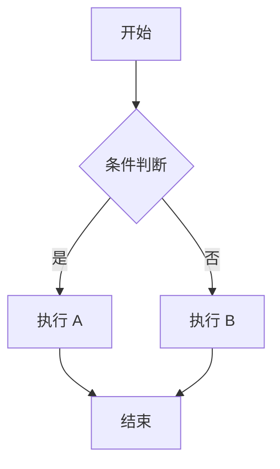
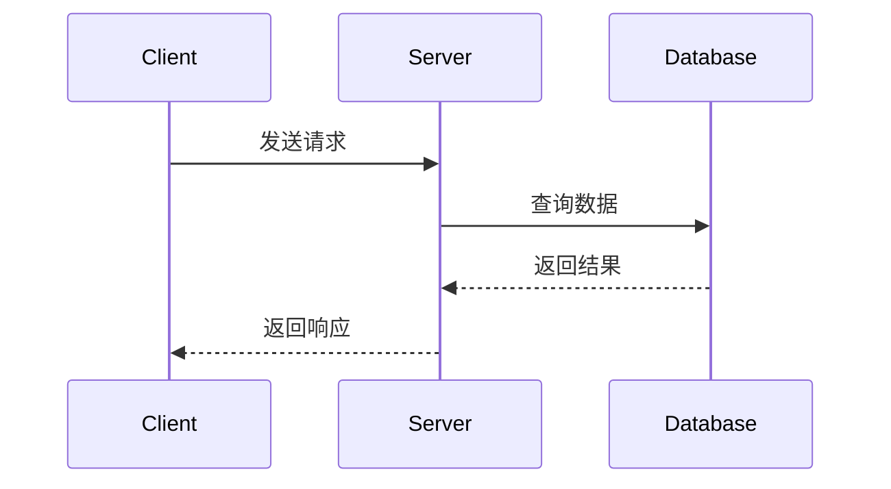
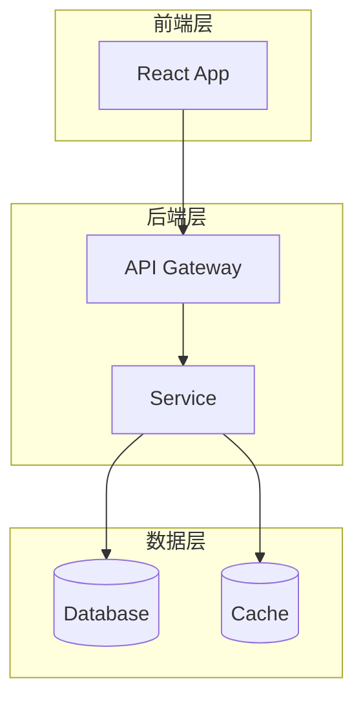
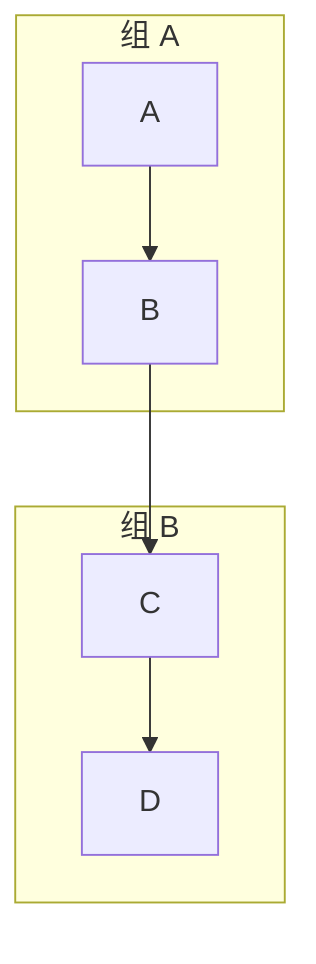

# rspress-plugin-mermaid 参考

在 Markdown 中通过 ` ```mermaid` 代码块渲染流程图、时序图、架构图等，编译期输出 SVG。

## 安装

```bash
npm i rspress-plugin-mermaid
# or
pnpm add rspress-plugin-mermaid
```

## 配置

```ts
// rspress.config.ts
import { defineConfig } from 'rspress/config';
import mermaid from 'rspress-plugin-mermaid';

export default defineConfig({
  plugins: [
    mermaid({
      mermaidConfig: {
        theme: 'forest',       // 主题: 'default' | 'forest' | 'dark' | 'neutral'
      },
    }),
  ],
});
```

`mermaidConfig` 中的所有选项将传递给 Mermaid 的 `mermaid.initialize()` 函数。

## 基础语法

### Flowchart（流程图）

````markdown

````

### Sequence Diagram（时序图）

````markdown

````

### Graph（架构图）

````markdown

````

## 常用图表类型速查

| 类型 | 关键字 | 适用场景 |
| --- | --- | --- |
| Flowchart | `graph TD` / `graph LR` | 流程、决策树、状态机 |
| Sequence | `sequenceDiagram` | API 调用链、微服务交互 |
| Class Diagram | `classDiagram` | 类型关系、继承结构 |
| State Diagram | `stateDiagram-v2` | 状态转换 |
| Entity Relationship | `erDiagram` | 数据模型 |
| Gantt | `gantt` | 项目时间线 |
| Pie | `pie` | 数据占比 |
| Git Graph | `gitGraph` | 分支策略 |

## 子图与分组



## 节点样式


## 何时使用 Mermaid

| 场景 | 原写法 | 改进 |
| --- | --- | --- |
| 架构关系 | 段落文字描述 | `graph TB` 架构图 |
| API 交互 | 分步骤编号列表 | `sequenceDiagram` 时序图 |
| 选项分支 | 缩进文本模拟分支 | `graph TD` 决策树 |
| 状态流转 | 表格 + 箭头符号 | `stateDiagram-v2` 状态图 |
| 数据模型 | 表格列举字段 | `erDiagram` ER 图 |

## 注意事项

- Mermaid 块在编译期渲染为 SVG，无运行时开销
- 主题通过 `mermaidConfig.theme` 设置，可选 `default` / `forest` / `dark` / `neutral`
- 复杂图表建议先用 Mermaid Live Editor 预览，确认无误再放入文档
- 节点文本中的特殊字符（如 `<br/>`）可正常使用
