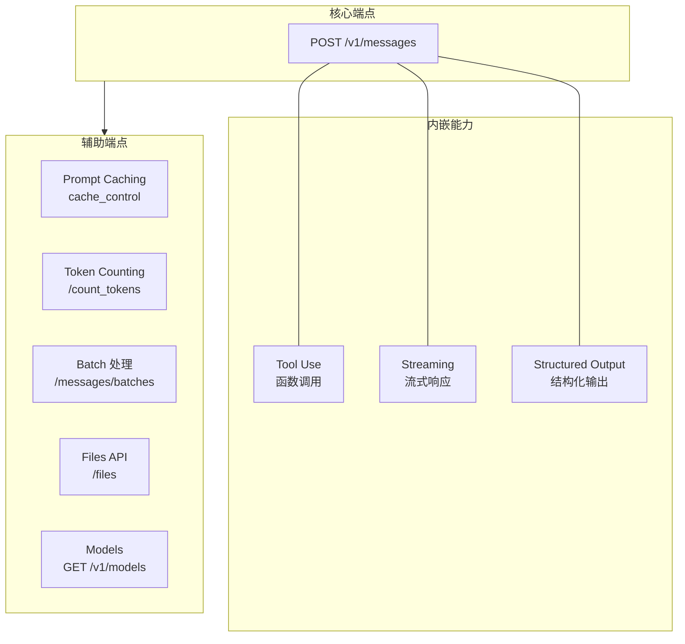
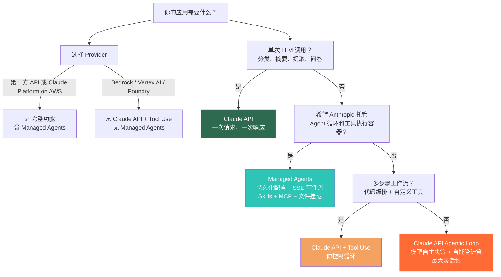
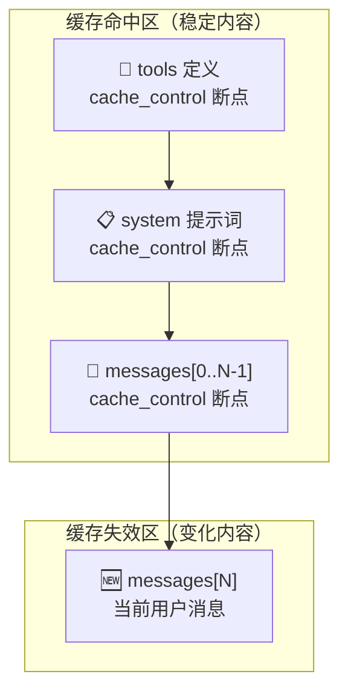
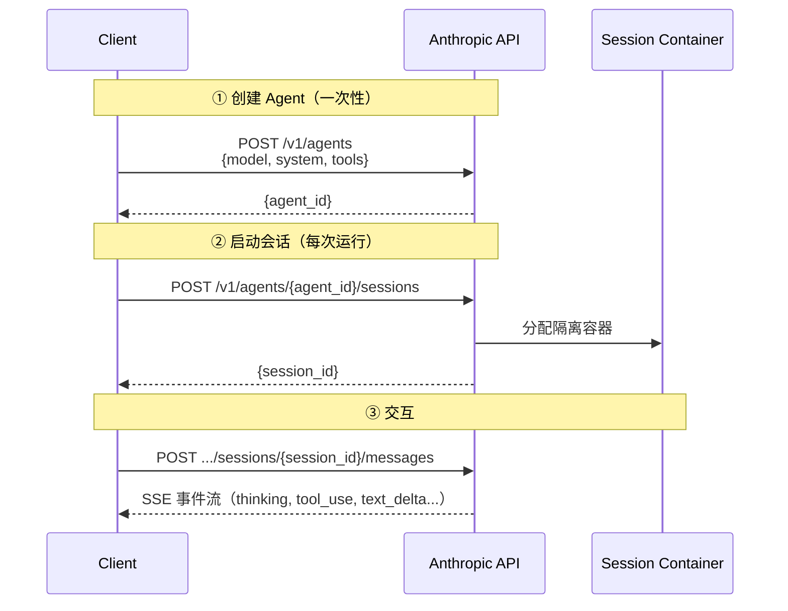

# Claude API 参考

## 概述

`claude-api` 是 Claude Code 内置的 API 参考 Skill，提供 Claude API 与 Anthropic SDK 的全方位参考资料——模型 ID、定价、参数、流式响应、Tool Use、MCP 集成、Agent 构建、Prompt Caching、Token 计数与模型迁移指南。

在编写任何调用 Claude API 的代码之前，应优先加载该 Skill 获取最新信息，而非凭记忆编码。

- **分类**：开发 & 集成
- **调用方式**：`/claude-api [subcommand]`
- **来源**：内置

## 触发条件

### 以下场景**必须**调用该 Skill：

- 代码中涉及 Claude/Anthropic API 调用（任一模型：Opus、Sonnet、Haiku、Fable）
- 用户询问 LLM 选型、定价、Token 限制、上下文窗口等通用问题（未明确指定其他厂商）
- 构建 Agent、MCP Server、Tool Definition、RAG 系统、LLM Judge 等 LLM 相关架构
- 使用 `anthropic` Python SDK 或 `@anthropic-ai/sdk` TypeScript SDK
- 处理流式响应、Token 计数、Prompt 缓存、模型迁移
- Debug 拒绝响应（refusal）、截断输出（cutoff）、工具调用异常

### 以下场景**不应**调用：

- 代码明确使用 OpenAI / GPT / Gemini / Llama / Mistral / Cohere / Ollama 等其他厂商
- 纯粹的前端 UI 开发（不涉及 API 调用层）

## 架构概述

所有请求统一走 `POST /v1/messages` 端点。Tool Use、结构化输出、流式响应都是该端点的功能特性，而非独立 API。



**辅助端点**：
- `POST /v1/messages/batches` — 异步批量处理（50% 价格）
- `POST /v1/files` — 文件上传，跨请求复用
- `POST /v1/messages/count_tokens` — Token 计数
- `GET /v1/models` / `GET /v1/models/{id}` — 模型能力实时查询

## 当前模型

:::warning
数据缓存日期：2026-06-04。模型 ID 必须使用完整字符串，**不要追加日期后缀**（如 `claude-sonnet-4-6-20251114` 是错误的）。
:::

| 模型 | Model ID | 上下文窗口 | 输入价格 ($/1M tokens) | 输出价格 ($/1M tokens) | 备注 |
| --- | --- | --- | --- | --- | --- |
| Claude Fable 5 | `claude-fable-5` | 1M | $15.00 | $75.00 | 最强推理能力，thinking 始终开启 |
| Claude Mythos 5 | `claude-mythos-5` | 1M | $15.00 | $75.00 | Project Glasswing 专属 |
| Claude Opus 4.8 | `claude-opus-4-8` | 1M | $15.00 | $75.00 | **默认推荐**，平衡性能与成本 |
| Claude Opus 4.7 | `claude-opus-4-7` | 1M | $15.00 | $75.00 | 与 4.8 相同 API 接口 |
| Claude Opus 4.6 | `claude-opus-4-6` | 1M | $15.00 | $75.00 | 支持 adaptive thinking |
| Claude Sonnet 4.6 | `claude-sonnet-4-6` | 1M | $3.00 | $15.00 | 性价比优先 |
| Claude Haiku 4.5 | `claude-haiku-4-5` | 200K | $1.00 | $5.00 | 轻量快速 |

:::tip 默认模型选择
除非用户明确指定，**始终使用 `claude-opus-4-8`**。不要自作主张降级到 Sonnet 或 Haiku——那是用户的决策，不是你的。
:::

## 核心参数

### 请求参数

| 参数 | 类型 | 必填 | 说明 |
| --- | --- | --- | --- |
| `model` | string | 是 | 模型 ID，如 `claude-opus-4-8` |
| `messages` | array | 是 | 对话消息列表，支持 `user` / `assistant` / `system` role |
| `max_tokens` | number | 是 | 最大输出 Token 数。非流式建议 `~16000`，流式建议 `~64000` |
| `system` | string/array | 否 | 系统提示词（支持 `cache_control` 断点） |
| `thinking` | object | 否 | 思考模式配置，见下文 |
| `output_config` | object | 否 | 输出配置：`effort`、`format`、`task_budget` |
| `tools` | array | 否 | 工具定义列表 |
| `stream` | boolean | 否 | 是否启用流式响应 |
| `temperature` | number | 否 | **Fable 5 / Opus 4.7+ / 4.8 已移除**，传入会 400 报错 |

### Thinking 配置

| 配置项 | 适用模型 | 说明 |
| --- | --- | --- |
| `thinking: {type: "adaptive"}` | Fable 5, Opus 4.6+ | **推荐**。模型自适应决定何时思考、思考多深 |
| `thinking: {type: "adaptive", display: "summarized"}` | Fable 5, Opus 4.8/4.7 | 返回可读的推理摘要（默认 `"omitted"`） |
| `thinking: {type: "disabled"}` | Opus 4.6/4.7/4.8 | 关闭思考（Fable 5 上显式传此值会 400，应省略参数） |
| ~~`thinking: {type: "enabled", budget_tokens: N}`~~ | 旧模型 | **已废弃**，Fable 5 / Opus 4.7+ / 4.8 上传入会 400 |

### Effort（推理深度）

通过 `output_config.effort` 控制，支持 `"low"` / `"medium"` / `"high"` / `"xhigh"` / `"max"`。

| Effort | 说明 | 适用场景 |
| --- | --- | --- |
| `low` | 最少思考，快速响应 | 子 Agent、简单分类、格式转换 |
| `medium` | 适度思考 | 常规任务 |
| `high` | 深度思考（默认） | 大多数编码和 Agent 任务的最佳平衡点 |
| `xhigh` | 极深思考 | Fable 5 / Opus 4.7/4.8 的编码与 Agent 场景首选 |
| `max` | 最大推理投入 | 高难度推理、数学证明、关键业务决策 |

```python
# Python 示例
response = client.messages.create(
    model="claude-opus-4-8",
    max_tokens=16000,
    messages=[{"role": "user", "content": "解释 monorepo 的 CI/CD 策略"}],
    thinking={"type": "adaptive"},
    output_config={"effort": "xhigh"},
)
```

```typescript
// TypeScript 示例
const response = await client.messages.create({
  model: "claude-opus-4-8",
  max_tokens: 16000,
  messages: [{ role: "user", content: "解释 monorepo 的 CI/CD 策略" }],
  thinking: { type: "adaptive" },
  output_config: { effort: "xhigh" },
});
```

## 使用场景与选型

### 决策树



### 构建 Agent 的四项检查

在选用 Agent 层级前，确认以下四项：

1. **复杂度** — 任务是否多步骤且难以预先完全指定？
2. **价值** — 结果是否值得更高的成本和延迟？
3. **可行性** — Claude 在该任务类型上能力足够吗？
4. **容错成本** — 错误能否被捕获并恢复（测试、审查、回滚）？

任一答案为"否"，停留在更简单的层级。

## Tool Use（函数调用）

### 基本模式

```python
# Python — 使用 SDK Tool Runner（自动循环）
from anthropic import Anthropic, BetaToolRunner

client = Anthropic()

def get_weather(location: str) -> str:
    """获取指定地点的天气"""
    return f"{location}：晴，22°C"

weather_tool = {
    "name": "get_weather",
    "description": "获取指定地点的天气",
    "input_schema": {
        "type": "object",
        "properties": {
            "location": {
                "type": "string",
                "description": "城市名称，如 'Beijing'",
            }
        },
        "required": ["location"],
    },
}

# Tool Runner 自动处理循环
messages = [{"role": "user", "content": "北京今天天气怎么样？"}]
runner = BetaToolRunner(tools=[weather_tool])
result = runner.run(client, messages, model="claude-opus-4-8", max_tokens=4096)
```

```typescript
// TypeScript — 使用 betaZodTool
import { Anthropic } from "@anthropic-ai/sdk";
import { betaZodTool } from "@anthropic-ai/sdk/resources/beta";

const client = new Anthropic();

const weatherTool = betaZodTool({
  name: "get_weather",
  description: "获取指定地点的天气",
  schema: z.object({
    location: z.string().describe("城市名称，如 'Beijing'"),
  }),
  handler: async ({ location }) => `${location}：晴，22°C`,
});
```

### 关键注意事项

- **Tool 输入始终用 `JSON.parse()` / `json.loads()` 解析**——Fable 5 和 4.6+ 系列的 JSON 转义可能与旧模型不同
- **不要做原始字符串匹配**来提取 tool input
- `strict: true` 可启用 Tool 参数的严格 Schema 校验

## Structured Output（结构化输出）

使用 `output_config.format` 约束响应格式：

```python
from anthropic import Anthropic

client = Anthropic()

response = client.messages.parse(
    model="claude-opus-4-8",
    max_tokens=4096,
    messages=[{"role": "user", "content": "提取这段文本中的公司名和金额"}],
    output_config={
        "format": {
            "type": "json_schema",
            "name": "extraction",
            "schema": {
                "type": "object",
                "properties": {
                    "company": {"type": "string"},
                    "amount": {"type": "number"},
                },
                "required": ["company", "amount"],
            },
        }
    },
)

# response 自动验证并解析为 Python 对象
print(response.company, response.amount)
```

:::warning 已废弃
使用 `output_config.format` 替代已废弃的 `output_format` 参数。
:::

## Streaming（流式响应）

构建 Chat UI 或需要实时展示的场景必须使用流式。

```python
# Python
with client.messages.stream(
    model="claude-opus-4-8",
    max_tokens=64000,
    messages=[{"role": "user", "content": "写一篇关于 Rust 异步编程的文章"}],
    thinking={"type": "adaptive"},
) as stream:
    for event in stream:
        if event.type == "content_block_delta":
            print(event.delta.text, end="", flush=True)

# 获取最终完整消息
final_message = stream.get_final_message()
```

```typescript
// TypeScript
const stream = client.messages.stream({
  model: "claude-opus-4-8",
  max_tokens: 64000,
  messages: [{ role: "user", content: "写一篇关于 Rust 异步编程的文章" }],
  thinking: { type: "adaptive" },
});

for await (const event of stream) {
  if (event.type === "content_block_delta") {
    process.stdout.write(event.delta.text);
  }
}

const finalMessage = await stream.finalMessage();
```

:::tip
**不要自己实现 Promise 包装**来收集流事件——SDK 提供了 `stream.get_final_message()` / `stream.finalMessage()`。
:::

## Prompt Caching（提示缓存）

### 核心原理

- **前缀匹配**：缓存从请求开头匹配，任何前缀字节变化都会使后续缓存失效
- **渲染顺序**：`tools` → `system` → `messages`
- **断点数量**：每个请求最多 4 个 `cache_control` 断点
- **最小可缓存前缀**：约 1024 tokens，少于这个量不会触发缓存

### 最佳布局



### 验证缓存是否生效

检查 `usage.cache_read_input_tokens` 字段——如果多次请求该值为零，说明存在"静默缓存失效"。

### 常见静默失效原因

- 系统提示词中包含 `datetime.now()` 等动态时间戳
- JSON key 顺序不一致
- Tool 定义在请求间变化
- 中间消息内容被修改（导致后续消息全部失效）

## Token 计数

```python
# Python
response = client.messages.count_tokens(
    model="claude-opus-4-8",
    messages=[{"role": "user", "content": "Hello, world!"}],
)
print(f"Input tokens: {response.input_tokens}")
```

:::danger 禁止使用 tiktoken
使用官方 `messages.count_tokens` API 来计数 Claude Token。Fable 5 使用新 Tokenizer，相同内容的 Token 数比 Opus 系列多约 30%——用 tiktoken 估算会严重偏差。
:::

## Managed Agents（Beta）

Managed Agents 是 Anthropic 服务端管理的状态化 Agent，提供：

- **持久化 Agent 配置**（版本控制）
- **按需容器会话**（文件操作、Bash、代码执行均在隔离容器中运行）
- **SSE 事件流**
- **Skills + MCP 集成**
- **文件挂载**

### 基本流程



:::tip 核心概念
**Agent 是持久化的——创建一次，通过 ID 引用。** 不要在请求路径中重复调用 `agents.create`。
:::

### 可用范围

| 平台 | Managed Agents |
| --- | --- |
| 第一方 API | ✅ 完整支持 |
| Claude Platform on AWS | ✅ 完整支持 |
| Amazon Bedrock | ❌ 不支持 |
| Google Vertex AI | ❌ 不支持 |
| Microsoft Foundry | ❌ 不支持 |

## 常见陷阱

### Thinking 配置

- **Fable 5 / Opus 4.7 / 4.8**：`thinking: {type: "enabled", budget_tokens: N}` → 400 错误。仅使用 `{type: "adaptive"}`
- **Fable 5**：显式 `{type: "disabled"}` → 400 错误。省略 thinking 参数即可
- **Opus 4.8 / 4.7**：`display` 默认为 `"omitted"`（不是 `"summarized"`），流式场景下看起来像长时间停顿。如需向用户展示推理过程，显式设置 `display: "summarized"`

### max_tokens

- **不要设得太低**——触及上限会截断输出。非流式默认 `~16000`，流式默认 `~64000`
- **Fable 5 / Opus 4.6+** 支持最大 128K 输出，但必须使用流式模式（避免 HTTP 超时）

### Assistant Prefill

- **Fable 5 / 4.6/4.7/4.8 系列已移除** Assistant message prefills——传入会返回 400
- 用 `output_config.format` 或 system prompt 指令控制输出格式

### Fable 5 特殊行为

- **Refusal stop reason**：安全检查拒绝请求时返回 HTTP 200 + `stop_reason: "refusal"`（不是 4xx）。始终先检查 `stop_reason` 再读取 `content`
- **新 Tokenizer**：相同内容比 Opus 系列多约 30% Token。重新用 `count_tokens` 测量，不要沿用旧数值
- **30 天数据保留要求**：Fable 5 不支持零数据保留设置
- **Thinking 块在模型间切换**：不同模型收到 thinking 块会静默忽略，但仍会计入输入 Token——切换模型时应剥离 thinking 块

### 通用

- **不要截断输入**：内容过长时通知用户讨论方案（分块、摘要等），而非静默截断
- **使用 SDK 类型**：不要自定 `interface ChatMessage`，SDK 已导出 `Anthropic.MessageParam`、`Anthropic.Tool` 等
- **使用 SDK 辅助方法**：`stream.finalMessage()` 而非手写 Promise；`Anthropic.RateLimitError` 而非字符串匹配错误

## 模型迁移速查

迁移代码到新模型时，按以下顺序执行：


1. **确认范围** — 问清迁移哪些文件/目录
2. **分类文件** — 区分直接调用 vs 封装层
3. **应用 Breaking Changes** — 见下表

| 从 | 到 | 主要变更 |
| --- | --- | --- |
| Opus 4.5 / Sonnet 4.5 | Opus 4.8 | `budget_tokens` 移除（用 `{type: "adaptive"}`）；`temperature`/`top_p`/`top_k` 移除；assistant prefill 移除；`output_format` → `output_config.format` |
| Opus 4.6 | Opus 4.8 | 无新增 breaking changes；behavioral 调整（默认 `display: "omitted"`，用 `"xhigh"` effort 获得最佳效果） |
| 任意 | Fable 5 | thinking 始终开启；`{type: "disabled"}` 无效；新 Tokenizer（+30% tokens）；refusal stop reason；30 天数据保留 |

:::info
完整迁移指南见 `shared/model-migration.md`（Skill 内部参考文件）。
:::

## 相关 Skills

- [[mcp-builder]] — 构建 MCP Server，连接 LLM 与外部服务
- [[skill-creator]] — 创建自定义 Skill 以封装领域知识
- [[deep-research]] — 多源深度调研，底层依赖 Claude API
- [[code-review]] — 代码审查，内部使用 Claude API 分析 diff
- [[web-artifacts-builder]] — 构建复杂 HTML Artifact，底层可对接 Claude API

## 参考资源

- [Anthropic Claude API 官方文档](https://docs.anthropic.com/en/docs)
- [Anthropic SDK — Python](https://github.com/anthropics/anthropic-sdk-python)
- [Anthropic SDK — TypeScript](https://github.com/anthropics/anthropic-sdk-typescript)
- [Claude Platform on AWS](https://docs.anthropic.com/en/docs/claude-platform-on-aws)
- [Model Context Protocol 规范](https://modelcontextprotocol.io)
- [Claude Code Skills 概览](https://docs.anthropic.com/en/docs/claude-code/skills)
