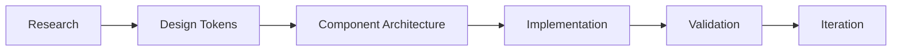

# Frontend UI Engineering

## 概述

`frontend-ui-engineering` 是社区维护的前端 UI 工程化 Skill，覆盖从研究、设计到实现、验证的完整 UI 开发流程。不同于 [[frontend-design]] 侧重视觉方向，该 Skill 聚焦于**工程实现层面**：组件架构、设计令牌管理、响应式布局策略、动画工程化、无障碍集成等。常见于 `oghie/skillsets` 和 `Kevinchamplin/claude-skills` 等社区仓库。

- **分类**：开发 & 集成
- **调用方式**：自动触发（UI 组件开发、设计系统实现）
- **来源**：社区

## 触发条件

以下场景应调用该 Skill：

- 建立或维护前端设计系统/组件库
- 从设计稿到代码的工程化落地
- 实现复杂的响应式布局
- 设计令牌（Design Tokens）的定义与管理
- CSS 架构选型（CSS Modules、Tailwind、styled-components）
- 动画与过渡效果的工程化实现
- 跨浏览器兼容性处理

以下场景**不应**使用：

- 纯视觉风格方向指导（使用 [[frontend-design]]）
- 框架特定的组件编写（使用框架专用 Skill 如 React/Vue）
- 后端 API 或数据库设计

## 核心流程



| 阶段 | 内容 |
| --- | --- |
| **Research** | 竞品分析、用户场景、设计趋势调研 |
| **Design Tokens** | CSS 变量、颜色系统、间距体系、字体层级 |
| **Component Architecture** | 原子设计（Atoms → Molecules → Organisms）、组合模式 |
| **Implementation** | React/Vue/Svelte 组件、CSS 方案、动画实现 |
| **Validation** | 无障碍审计、性能测试、视觉回归测试 |
| **Iteration** | 组件文档、Storybook 集成、持续迭代 |

## 使用示例

### 安装（以 oghie/skillsets 为例）

```bash
npx skills add oghie/skillsets --skill uiux-frontend-engineering
```

### 设计令牌生成

```
"为这个项目生一套完整的设计令牌，包括颜色、间距、字体层级和阴影"
```

Skill 将生成类似以下结构：

```css
:root {
  /* Colors */
  --color-primary: #2563eb;
  --color-primary-foreground: #ffffff;
  --color-muted: #f3f4f6;

  /* Spacing */
  --space-1: 0.25rem;
  --space-2: 0.5rem;
  --space-4: 1rem;
  --space-8: 2rem;

  /* Typography */
  --text-xs: 0.75rem;
  --text-base: 1rem;
  --text-2xl: 1.5rem;

  /* Shadows */
  --shadow-sm: 0 1px 2px rgba(0, 0, 0, 0.05);
  --shadow-md: 0 4px 6px rgba(0, 0, 0, 0.1);
}
```

## 最佳实践

- 在项目早期定义设计令牌，避免硬编码样式值分散在各组件中
- 使用 CSS 变量 + `@theme`（Tailwind v4）实现主题切换
- 组件遵循"组合优于继承"原则，优先使用 `children` / slots
- 每个组件应包含 Loading、Empty、Error、Success 四种状态
- 通过 [[playwright-best-practices]] 编写组件视觉回归测试

## 注意事项

- 设计令牌是跨平台的概念，确保 Web、Mobile、Email 模板等场景的一致性
- 避免过早抽象 — 在 3+ 个组件出现重复模式时再提取公共组件
- 动画应遵循 `prefers-reduced-motion` 媒体查询，兼顾无障碍体验

## 相关 Skills

- [[frontend-design]] — 视觉风格方向与美学指导
- [[vercel-react-best-practices]] — React 组件性能优化
- [[shadcn]] — shadcn/ui 组件库集成
- [[web-quality]] — 无障碍与性能审计

## 参考资源

- [oghie/skillsets](https://github.com/oghie/skillsets)
- [Kevinchamplin/claude-skills](https://github.com/Kevinchamplin/claude-skills)
- [Design Tokens 规范](https://tr.designtokens.org/)
