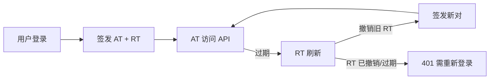

# 认证授权

## 概述

后端认证授权涵盖两个层面：**认证（Authentication）** —— 确认"你是谁"，**授权（Authorization）** —— 确认"你能做什么"。常见方案为 JWT（无状态令牌）+ Passport（策略抽象）+ Guard（权限路口）。

## 核心主题

| 主题 | 文档 | 覆盖内容 |
| --- | --- | --- |
| JWT 认证 | [[jwt-auth]] | Passport JWT 策略、bcrypt 密码哈希、注册/登录流程 |
| GraphQL Guard | [[graphql-guard]] | 将 HTTP AuthGuard 适配为 GraphQL 守卫、权限矩阵 |
| Refresh Token | [[refresh-token]] | Token 轮换策略、UUID 防猜测、撤销与过期机制 |

## Token 体系

| Token 类型 | 有效期 | 存储位置 | 格式 |
| --- | --- | --- | --- |
| Access Token | 15 分钟 | 无（JWT 自包含） | JWT（`sub`, `iat`, `exp`） |
| Refresh Token | 7 天 | 数据库 `refresh_tokens` 表 | UUID v4 |

