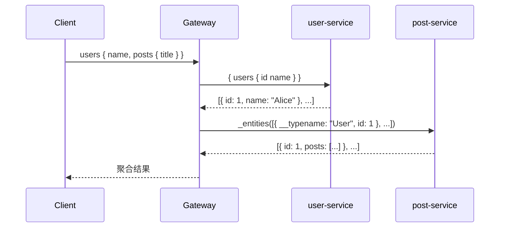

# Federation 微服务架构

## 概述

GraphQL Federation 是 Apollo 提出的微服务架构模式，允许将大型 GraphQL Schema 拆分为多个独立部署的 Subgraph，通过 Gateway 聚合为统一的 Supergraph 对外暴露。每个 Subgraph 独立开发、部署、扩展，Gateway 负责查询分发与结果聚合。

## 架构对比

| 模式 | 结构 | 适用场景 |
| --- | --- | --- |
| **单体** | 单一 NestJS 应用，所有 Module 在一个进程 | 小型项目、快速迭代 |
| **Federation** | 多个独立 Subgraph + Gateway 聚合 | 团队拆分、独立部署、技术栈异构 |

## Monorepo 结构

```tree
apps/
├── gateway/          # Apollo Gateway / Router
├── auth-service/     # 认证服务
├── user-service/     # 用户服务
└── post-service/     # 文章服务
packages/
└── shared/           # 共享类型、工具、DTO
```

## Subgraph 改造

### 安装

```bash
pnpm add @apollo/subgraph
```

### 声明为 Subgraph

```typescript
GraphQLModule.forRoot<ApolloFederationDriverConfig>({
  driver: ApolloFederationDriver,
  autoSchemaFile: true,
  // federation 插件自动添加 _service 和 _entities 查询
}),
```

### Federation 指令

| 指令 | 作用 |
| --- | --- |
| `@Key` | 标记实体主键，用于跨服务引用 |
| `@Shareable` | 标记字段可被多个 Subgraph 定义 |
| `@External` | 标记字段由其他 Subgraph 提供 |
| `@Provides` | 本 Subgraph 可为外部字段提供额外计算 |
| `@Requires` | 声明需要外部字段才能解析 |

### 跨服务实体引用

```graphql
# auth-service
type User @key(fields: "id") {
  id: Int!
  email: String!
}

# post-service（扩展 auth-service 的 User 类型）
type User @key(fields: "id") {
  id: Int!
  posts: [Post!]!
}
```

## Gateway 配置

```typescript
@Module({
  imports: [
    GraphQLModule.forRoot<ApolloGatewayDriverConfig>({
      driver: ApolloGatewayDriver,
      gateway: {
        supergraphSdl: new IntrospectAndCompose({
          subgraphs: [
            { name: 'auth', url: 'http://auth-service:3001/graphql' },
            { name: 'users', url: 'http://user-service:3002/graphql' },
            { name: 'posts', url: 'http://post-service:3003/graphql' },
          ],
        }),
      },
    }),
  ],
})
export class GatewayModule {}
```

## 跨服务查询流程

```graphql
query {
  users {
    name          # ← user-service
    posts {       # ← post-service（通过 @Key 连接）
      title
    }
  }
}
```



一次请求 → Gateway 拆分为并行子查询 → 分发到各 Subgraph → 聚合返回。

## Supergraph 组合

Gateway 定期通过 `IntrospectAndCompose` 拉取各 Subgraph 的 Schema，组合为 Supergraph Schema 后统一对外暴露。

## 技术选型

- **包管理**：pnpm workspace
- **Gateway**：Apollo Gateway / Router
- **Subgraph**：@apollo/subgraph
- **通信**：HTTP（内部 GraphQL 调用）

## 注意事项

- Federation 引入额外的网络开销和网关复杂度，权衡是否需要微服务拆分
- Subgraph 间应避免循环依赖，通过 `@Key` + `@External` 单向引用
- 身份认证建议在 Gateway 层统一处理，Subgraph 通过 context 接收已验证的用户信息
