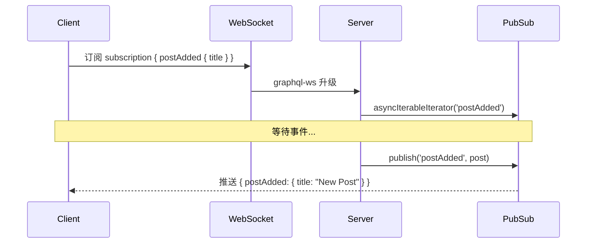

# Subscription 实时推送

## 概述

GraphQL Subscription 基于 WebSocket（graphql-ws 协议）实现服务端向客户端的实时数据推送。典型场景：聊天消息通知、数据变更提醒、实时协作编辑。NestJS 通过 `graphql-subscriptions` 的 PubSub 发布/订阅引擎驱动 Subscription。

## 安装

```bash
pnpm add graphql-ws graphql-subscriptions
```

| 包 | 版本 | 用途 |
| --- | --- | --- |
| `graphql-ws` | 6.0.8 | WebSocket 协议实现 |
| `graphql-subscriptions` | 3.0.0 | PubSub 发布/订阅引擎 |

> NestJS GraphQL 13 不再从 `@nestjs/graphql` 导出 `PubSub`，需从 `graphql-subscriptions` 独立导入。

## GraphQLModule 配置

```typescript
// src/app.module.ts
GraphQLModule.forRoot<ApolloDriverConfig>({
  driver: ApolloDriver,
  autoSchemaFile: join(process.cwd(), 'schema.gql'),
  sortSchema: true,
  csrfPrevention: false,
  subscriptions: {
    'graphql-ws': true,   // 在同一 HTTP 端口上启用 WebSocket 升级
  },
  plugins: [ApolloServerPluginLandingPageLocalDefault()],
}),
```

## PubSub 模块

```typescript
// src/pubsub/pubsub.module.ts
import { Global, Module } from '@nestjs/common';
import { PubSub } from 'graphql-subscriptions';

@Global()
@Module({
  providers: [
    {
      provide: 'PUB_SUB',
      useValue: new PubSub(),
    },
  ],
  exports: ['PUB_SUB'],
})
export class PubSubModule {}
```

## 实现 Subscription

### Resolver 端

```typescript
// src/post/post.subscription.resolver.ts
import { Resolver, Subscription } from '@nestjs/graphql';
import { Inject } from '@nestjs/common';
import { PubSub } from 'graphql-subscriptions';

const POST_ADDED = 'postAdded';

@Resolver()
export class PostSubscriptionResolver {
  constructor(@Inject('PUB_SUB') private readonly pubSub: PubSub) {}

  @Subscription(() => Post, {
    name: POST_ADDED,
  })
  postAdded() {
    return this.pubSub.asyncIterableIterator(POST_ADDED);
  }
}
```

### 触发端（Mutation 中发布）

```typescript
// src/post/post.resolver.ts
@Mutation(() => Post)
async createPost(@Args('input') input: CreatePostInput) {
  const post = await this.postService.create(input);
  await this.pubSub.publish('postAdded', { postAdded: post });
  return post;
}
```

## 数据流



## 测试验证

### Sandbox 中订阅

在 Apollo Sandbox 左侧面板输入：

```graphql
subscription {
  postAdded {
    id
    title
    createdAt
  }
}
```

点击 Run，Sandbox 进入等待状态。然后在另一个标签页执行 `createPost` mutation，订阅端实时收到通知。

### curl 验证（graphql-ws 协议）

WebSocket 连接需要 `graphql-ws` 客户端，curl 不支持。可使用 `ws://localhost:3000/graphql` 端点配合 wscat 等工具测试。

## 注意事项

- `PubSub` 是内存实现，仅适合单进程开发和测试。生产环境应使用 Redis PubSub 或 Kafka 等外部消息队列
- `graphql-ws` 与旧版 `subscriptions-transport-ws` 不兼容，客户端需使用支持新协议的库
- Subscription 的 `validate` / `filter` 选项可用于鉴权和消息过滤
