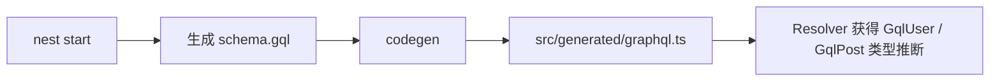

# GraphQL Codegen

## 概述

NestJS Code First 模式自动生成 `schema.gql`，GraphQL Codegen 进一步从 Schema 生成 TypeScript 类型定义，让 Resolver 获得完整的类型推断。通过 `mappers` 配置将生成的 GraphQL 类型映射到 NestJS 实体类，避免类型冲突。

## 安装

```bash
pnpm add -D @graphql-codegen/cli @graphql-codegen/typescript @graphql-codegen/typescript-resolvers
```

## codegen.ts 配置

```typescript
import type { CodegenConfig } from '@graphql-codegen/cli';

const config: CodegenConfig = {
  schema: './schema.gql',
  generates: {
    './src/generated/graphql.ts': {
      plugins: ['typescript', 'typescript-resolvers'],
      config: {
        // 生成的 GraphQL 类型加 Gql 前缀，避免与 NestJS 实体类命名冲突
        typesPrefix: 'Gql',
        // 将 NestJS ObjectType 类映射为 resolver 的 parent 类型
        mappers: {
          User: '../user/entities/user.entity#User',
          Post: '../post/entities/post.entity#Post',
          AuthPayload: '../auth/entities/auth-payload.entity#AuthPayload',
        },
        contextType: './context#GraphQLContext',
        enumsAsTypes: true,
      },
    },
  },
};

export default config;
```

## GraphQL Context 类型

```typescript
// src/generated/context.ts
export interface GraphQLContext {
  req: {
    user?: User;
  };
  res: Response;
}
```

## 生成类型示例

```typescript
// 生成的类型前缀为 Gql，与实体类区分
import { GqlUser, GqlPost, GqlMutationResolvers, GqlQueryResolvers } from './generated/graphql';

// GqlUser 类型（从 schema 生成，与 User 实体对应）
type GqlUser = {
  __typename?: 'User';
  createdAt: string;
  email: string;
  id: number;
  name: string;
  posts: GqlPost[];
  updatedAt: string;
};
```

## NPM Scripts

```json
{
  "codegen": "graphql-codegen --config codegen.ts",
  "codegen:watch": "graphql-codegen --config codegen.ts --watch",
  "prebuild": "pnpm codegen"
}
```

| 命令 | 说明 |
| --- | --- |
| `pnpm codegen` | 手动生成类型 |
| `pnpm codegen:watch` | 监听 schema 变化自动生成 |
| `pnpm build` | 构建前自动执行 codegen（prebuild hook） |

## 工作流程



## 文件管理

| 文件 | Git | 说明 |
| --- | --- | --- |
| `src/generated/graphql.ts` | ignored | GraphQL 类型 + Resolver 签名（自动生成） |
| `src/generated/context.ts` | **committed** | GraphQLContext 类型定义（手写） |

> `src/generated/` 目录整体加入 `.gitignore`，`context.ts` 作为手写文件例外提交。

## 最佳实践

- `typesPrefix: 'Gql'` 避免生成的 `User` 类型与 NestJS `User` 实体类命名冲突
- `mappers` 让 Resolver 的 `@Parent()` 参数类型推断为实体类而非生成的 GraphQL 类型
- `prebuild` hook 确保每次构建前 Codegen 与当前 Schema 保持同步
- CI 中 `typecheck` job 在 `pnpm build` 之后运行 `pnpm codegen`，验证类型生成可正常执行
