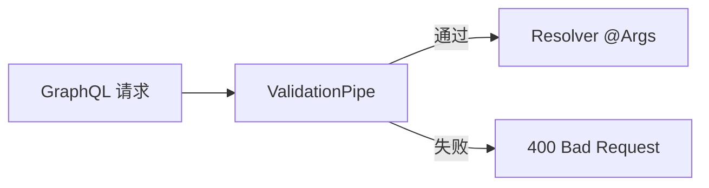

# DTO 校验

## 概述

在 NestJS 中，DTO（Data Transfer Object）通过 `class-validator` 装饰器实现声明式校验。GraphQL Code First 模式下，`@InputType()` 与校验装饰器叠加，在 `ValidationPipe` 的管道阶段自动拦截非法输入，Resolver 收到的参数保证类型安全。

## 前置知识

- 已了解 NestJS [[nest-basics|三层架构]]
- 已配置 [[graphql-code-first|GraphQL Code First]]

## CreateUserInput

```typescript
// src/user/dto/create-user.input.ts
import { InputType, Field } from '@nestjs/graphql';
import { IsString, IsEmail, MinLength } from 'class-validator';

@InputType()
export class CreateUserInput {
  @Field()
  @IsString()
  @MinLength(2)
  name: string;

  @Field()
  @IsEmail()
  email: string;
}
```

## UpdateUserInput

```typescript
// src/user/dto/update-user.input.ts
import { InputType, Field, Int } from '@nestjs/graphql';
import { IsString, IsEmail, IsOptional, MinLength } from 'class-validator';

@InputType()
export class UpdateUserInput {
  @Field(() => Int)
  id: number;

  @Field({ nullable: true })
  @IsOptional()
  @IsString()
  @MinLength(2)
  name?: string;

  @Field({ nullable: true })
  @IsOptional()
  @IsEmail()
  email?: string;
}
```

## 常用装饰器

| 装饰器 | 用途 |
| --- | --- |
| `@IsString()` | 字符串类型校验 |
| `@IsEmail()` | 邮箱格式校验 |
| `@MinLength(n)` | 最小长度 |
| `@MaxLength(n)` | 最大长度 |
| `@IsOptional()` | 字段可选（配合 `nullable`） |
| `@IsInt()` | 整数校验 |
| `@IsBoolean()` | 布尔校验 |
| `@IsEnum()` | 枚举值校验 |

## 目录结构

```tree
src/user/dto/
├── create-user.input.ts    # @InputType — 必填字段校验
└── update-user.input.ts    # @InputType — 可选字段（Partial）
```

## 校验流程



`ValidationPipe` 在 `main.ts` 全局注册后，每个 GraphQL 请求的 `@Args()` 参数自动经过校验管道。非法输入直接返回错误，不会进入 Resolver。
