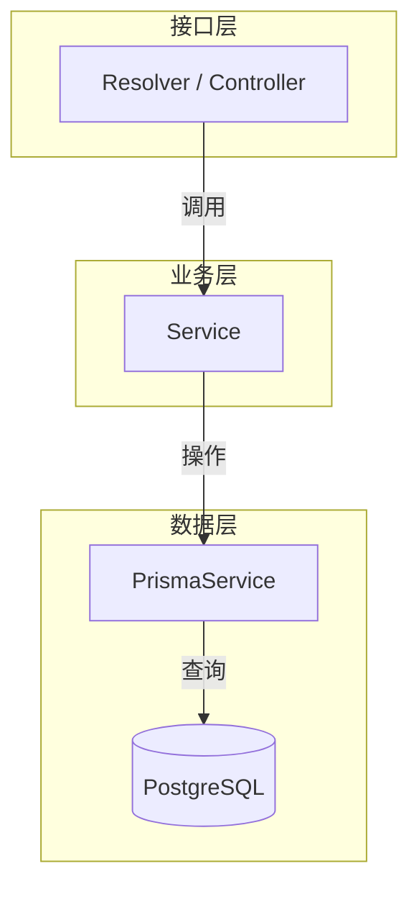

# NestJS 基础与三层架构

## 概述

NestJS 采用经典的三层架构：**Controller/Resolver（接口层）→ Service（业务逻辑层）→ Repository/Prisma（数据访问层）**。每个功能领域封装为独立 Module，通过依赖注入（DI）解耦。

## 项目初始化

```bash
npm init -y
pnpm add @nestjs/core @nestjs/common @nestjs/platform-express reflect-metadata rxjs
pnpm add -D @nestjs/cli typescript @types/node ts-node
```

### 依赖版本参考（2026 年 6 月）

| 包名 | 版本 | 用途 |
| --- | --- | --- |
| `@nestjs/core` | ^11.1.27 | 框架核心 |
| `@nestjs/common` | ^11.1.27 | 装饰器、工具函数 |
| `@nestjs/platform-express` | ^11.1.27 | Express 平台适配器 |
| `reflect-metadata` | ^0.2.2 | 装饰器元数据 |
| `rxjs` | ^7.8.2 | 响应式编程（底层依赖） |
| `@nestjs/cli` (dev) | ^11.0.23 | 脚手架 CLI |

## 入口文件

```typescript
// src/main.ts
import { NestFactory } from '@nestjs/core';
import { AppModule } from './app.module';

async function bootstrap() {
  const app = await NestFactory.create(AppModule);
  await app.listen(3000);
  console.log('Application is running on: http://localhost:3000');
}
bootstrap();
```

## 脚本命令

```json
{
  "build": "nest build",
  "start": "nest start",
  "start:dev": "nest start --watch",
  "start:prod": "node dist/main"
}
```

## 三层架构示意



## 模块注册

```typescript
// src/app.module.ts
import { Module } from '@nestjs/common';
import { UserModule } from './user/user.module';

@Module({
  imports: [UserModule],
})
export class AppModule {}
```

## 最佳实践

- 每个功能领域一个模块（User、Post、Auth），避免巨型单模块
- Service 保持无状态或 REQUEST 作用域，通过依赖注入消费其他 Service
- 不要在 Controller/Resolver 中直接操作数据库，始终通过 Service 层
- `main.ts` 中统一注册全局 Pipe、Guard、Interceptor
